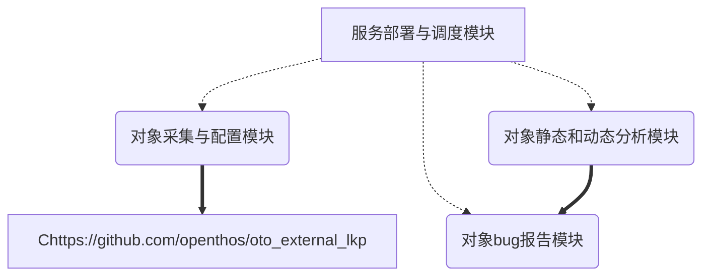

## KIS == Kernel Instant testing Service 

## 需求分析

### 存在的问题

#### bug平均生存期在增加

从我们对Linux Kernel Git Tree(LKGT)、bugzilla.kernel.org (Linux Kernel Bug Tracker, LKBT)和Linux内核邮件列表(LKML)的定量分析中可以看出，每个内核开发周期中内核Bug的平均生存期在增加。发人员在当前的Linux内核中发现bug存在着前所未有的困难。

#### 很难确定bug的错误来源

尽管当前的bug检测技术和工具发展得很快，但它们不能有效地帮助内核开发人员修复bug。这些工具分别用于分析已发布的Linux内核，但没有一起分析日常内核开发的每个更新提交。更重要的是，几乎不可能为内核开发人员提供足够的计算资源来集成各种各样的分析工具，从而使检测内核bug变得快速和简单。此外，一旦提交了新的内核提交，开发人员就很难确定错误的来源，更不用说及时给引起错误的开发者提供提醒和相关重现bug的分析信息等。

#### 没有时间修复深层bug

在平均2.5个月的内核开发周期的压力下，内核开发人员总是在修复bug和添加新特性之间平衡时间。在资源有限的情况下，开发人员可能会使用一些快速分析工具和技术来发现和修复相对简单的内核bug，即预发布的内核bug。但是，开发人员没有那么多时间来投资于隐藏很深的内核bug，尤其是那些源自于较早发布的内核的bug。这些遗漏的bug称为发布后的内核bug，可能会泄漏到未来的内核中，需要付出更多的努力来修复。

### 提供支持

我们认为设计一个面向大型软件（以OS Kernel为代表）的即时测试服务，可以直接帮助开发人员检测bug，从而最终降低bug寿命，维护大型软件的稳定性。不仅是Linux内核，其他大型开源项目(如Android， Linux distributions等)对其活动开发模型也有类似的测试需求。KIS是我们为Linux内核提供即时测试服务的第一步，并且能够实现及时（小于一个小时）的响应时间。根据内核开发人员的反馈，分钟级甚至更短的内核bug检测响应时间下一步的目标。为此需要能够提供如下具体的支持。

#### 即时的编译/运行测试

一旦发现有不同的git repo上提交了新的git commit，就立刻取回，合并到主开发分支，并进行配置，编译，安装，运行测试一系列执行过程，并通过各种优化手段得到测试结果。

#### 准确的错误报告

主要通过改进的git bisect方法，并结合其他辅助手段来定位引发错误的git commit，并生成可重现的脚本，通过email等方式发给此git commit的作者，请他修复。

#### 广泛的测试覆盖

设置不同的软件配置，选用不同的测试用例，不同的测试工具（静态工具和动态工具），全面测试软件的各个静态和动态分析结果，获得统计数据和差异分析。

## 概要设计

### 服务对象

基于开源软件[lkp-test])(https://github.com/intel/lkp-tests.git)，从Linux kernel作为测试服务对象，并逐步过渡到其他大型软件（如，Android， OPNTHOS等）。

### 总体架构

KIS是一个逻辑上集中，物理上分布的系统，其体系结构主要由四部分组成，各个对象模块有一系列的微服务组成，并统一被服务部署与调度模块管理与调度。

- 服务部署与调度模块：管理并调度下面三个对象模块中的各个微服务到不同的服务节点上运行。
- 对象采集与配置模块：负责从内核开发人员的git存储库中提取更新的内核源代码，配置内核，并生成用于编译和静态分析的分析目标列表。
- 对象静态和动态分析模块：负责执行编译以及执行内核更改集的静态和动态分析。
- 对象bug报告模块：负责快速分析、过滤和定位编译错误、静态分析发现的bug以及运行内核的崩溃日志，生成错误报告，并直接向最可能引入错误的内核开发人员提供精确的详细分析和重现信息。



## 详细设计

### 对象采集与配置模块

负责从内核开发人员的git存储库中提取更新的内核源代码，配置内核，并生成用于编译和静态分析的分析目标列表。由如下微服务组成。

#### 采集服务

采集服务由repo列表、更新微服务、配置微服务等组成。

##### repo列表

[linux kernel repos](https://github.com/openthos/lkp-tests/tree/master/repo)列出了Linux kernel的不同repos和详细信息。文档有一层目录+文件组成。目录名说明了repo的分类信息。目录中的文件包括：
- DEFAULTS：缺省的描述信息

```
release_tag_pattern:
  R(?<major>\d+)_(?<minor>\d+)_(?<micro>\d+)
belongs_to: acpica
```

- repo-name：repo的描述信息

  ```
  url: https://github.com/acpica/acpica
  upstream: true
  mail_to:
    - lkp@intel.com
  ```

##### 更新微服务

[更新微服务的原型](https://github.com/openthos/system-analysis/blob/master/updateGIT.sh)后续还需修改。其处理流程是：读取repo列表，解析出repo列表中各个repo的信息，访问相关repo的branch，如果有更新的commit，吧次commit取回，并merge到Linux开发的[next分支](https://git.kernel.org/pub/scm/linux/kernel/git/next/linux-next.git)或[主干分支](https://github.com/torvalds/linux)上。

注意事项和潜在问题

- 获取git commit失败如何处理
- merge失败如何处理
- 如何部署更新微服务
- merge或patch的需要遵循的经验法则(from [Linux Docs](https://github.com/torvalds/linux/blob/master/Documentation/translations/zh_CN/process/5.Posting.rst#%E8%A1%A5%E4%B8%81%E5%87%86%E5%A4%87))

##### 配置微服务

更新微服务获取并merge新的commit成功中，生成kernel配置，不同的配置可能导致编译或运行bug/regression等问题。Where???

注意事项和潜在问题

- kernel配置需要基于运行的机器、常见配置的经验和随机性生成不同的配置，从而在覆盖的全面性，与更新的相关性和有限配置数中取得一个平衡。

### 对象静态和动态分析模块

本模块主要负责执行编译以及执行内核更改集的静态和动态分析。


