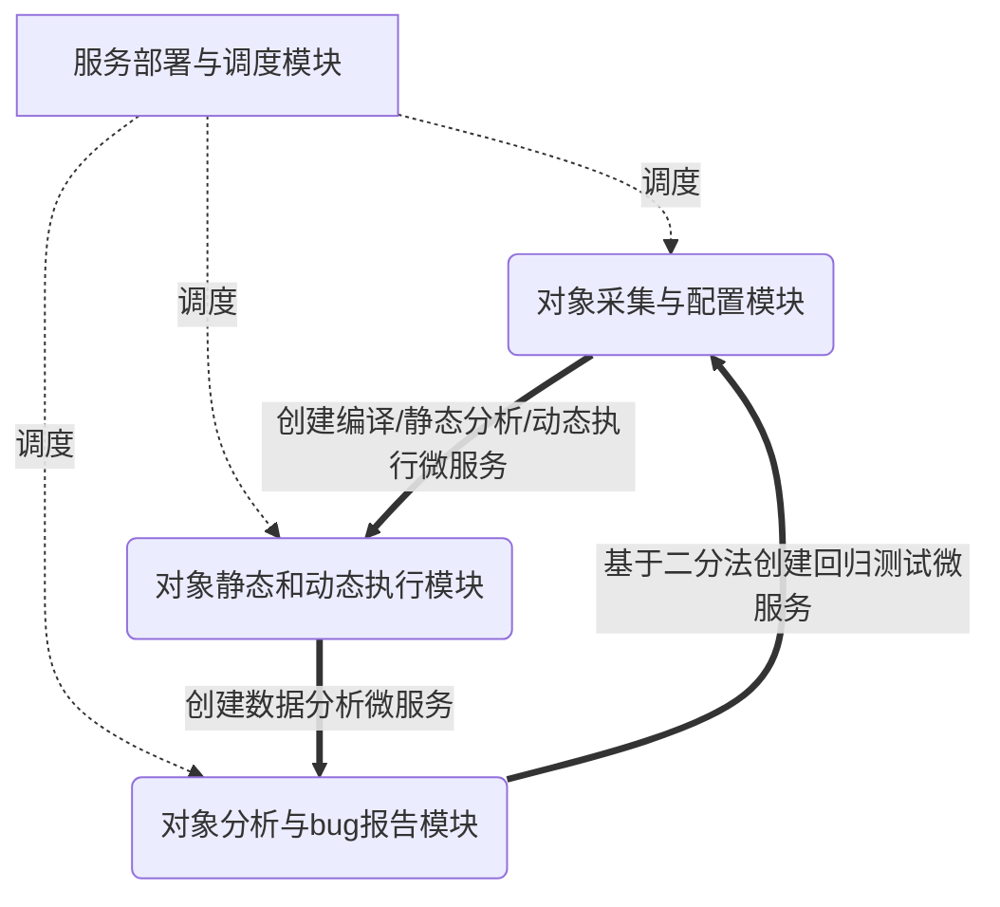
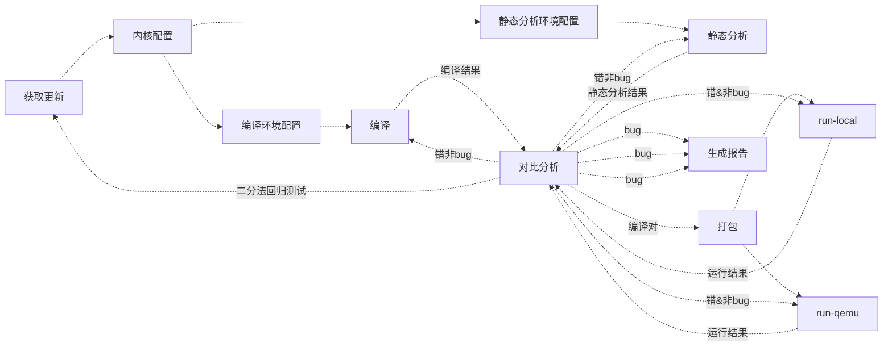

## KIS（Kernel Instant testing Service ）

## 需求分析

### 存在的问题

在所有的这些内核测试工作中，最大问题就是资源，我们需要更多的人和更多的机器，从而可以更早地发现和修复错误。

#### bug平均生存期在增加

从我们对Linux Kernel Git Tree(LKGT)、bugzilla.kernel.org (Linux Kernel Bug Tracker, LKBT)和Linux内核邮件列表(LKML)的定量分析中可以看出，每个内核开发周期中内核Bug的平均生存期在增加。发人员在当前的Linux内核中发现bug存在着前所未有的困难。

#### 很难确定bug的错误来源

尽管当前的bug检测技术和工具发展得很快，但它们不能有效地帮助内核开发人员修复bug。这些工具分别用于分析已发布的Linux内核，但没有一起分析日常内核开发的每个更新提交。更重要的是，几乎不可能为内核开发人员提供足够的计算资源来集成各种各样的分析工具，从而使检测内核bug变得快速和简单。此外，一旦提交了新的内核提交，开发人员就很难确定错误的来源，更不用说及时给引起错误的开发者提供提醒和相关重现bug的分析信息等。

#### 没有时间修复深层bug

在平均2.5个月的内核开发周期的压力下，内核开发人员总是在修复bug和添加新特性之间平衡时间。在资源有限的情况下，开发人员可能会使用一些快速分析工具和技术来发现和修复相对简单的内核bug，即预发布的内核bug。但是，开发人员没有那么多时间来投资于隐藏很深的内核bug，尤其是那些源自于较早发布的内核的bug。这些遗漏的bug称为发布后的内核bug，可能会泄漏到未来的内核中，需要付出更多的努力来修复。

### 需求描述

#### 基本大需求

提供对晚上数百个更新的linux kernel repos进行及时测试。

#### 小需求

- 支持广域网+局域网的两层架构
- 通过异步/RPC/消息机制/分布式集中调度来使得系统运行支持容错，支持负载平衡
- 通过微服务+策略描述的组合来形成支持不同开发者和测试需求方的定制化测试需求
- 支持不同类型的错误分析（merge类，compiling类，running类）
- 支持不同硬件平台或不同应用
- 形成对生成的大数据（分布在不同的地方）的快速分析能力

### 提供支持

我们认为设计一个面向大型软件（以OS Kernel为代表）的即时测试服务，可以直接帮助开发人员检测bug，从而最终降低bug寿命，维护大型软件的稳定性。不仅是Linux内核，其他大型开源项目(如Android， Linux distributions等)对其活动开发模型也有类似的测试需求。KIS是我们为Linux内核提供即时测试服务的第一步，并且能够实现及时（小于一个小时）的响应时间。根据内核开发人员的反馈，分钟级甚至更短的内核bug检测响应时间下一步的目标。为此需要能够提供如下具体的支持。

#### 即时的编译/运行测试

一旦发现有不同的git repo上提交了新的git commit，就立刻取回，合并到主开发分支，并进行配置，编译，安装，运行测试一系列执行过程，并通过各种优化手段得到测试结果。

#### 准确的错误报告

主要通过改进的git bisect方法，并结合其他辅助手段来定位引发错误的git commit，并生成可重现的脚本，通过email等方式发给此git commit的作者，请他修复。

#### 广泛的测试覆盖

设置不同的软件配置，选用不同的测试用例，不同的测试工具（静态工具和动态工具），全面测试软件的各个静态和动态分析结果，获得统计数据和差异分析。

## 概要设计

### 服务对象

首先是把Linux kernel作为测试服务对象。

在测试运行部分，可基于开源软件[lkp-test](https://github.com/intel/lkp-tests.git)，从Linux kernel作为测试服务对象，并逐步过渡到其他大型软件（如 Android，OPENTHOS等）。

### 硬件环境

两层分布式架构（外层基于internet互联，由m个local network组成；内层基于local network，由n台服务器（CPU不限）组成）。

### 总体架构

KIS是一个逻辑上集中，物理上分布的两层分布式系统，其体系结构主要由四部分组成，各个对象模块有一系列的微服务(小的服务程序)组成，并统一被服务部署与调度模块管理与调度。

- 服务部署与调度模块：管理并调度下面三个对象模块中的各个微服务到不同的服务节点上运行。
- 对象采集与配置模块：负责从内核开发人员的git存储库中提取更新的内核源代码，配置内核，并生成用于编译和静态分析的分析目标列表。
- 对象静态和动态执行模块：负责执行编译以及执行内核更改集的静态和动态分析。
- 对象分析与bug报告模块：负责快速分析、过滤和定位编译错误、静态分析发现的bug以及运行内核的崩溃日志，生成错误报告，并直接向最可能引入错误的内核开发人员提供精确的详细分析和重现信息。



### 注意事项和潜在问题

- 绝大部分微服务都是无状态的，即可以从某个微服务开始，重现整个执行流程。
- 总调度服务和二分法分析服务是两个特殊的有状态的服务。
- 微服务即相对独立运行的功能单一的小程序，可被部署到不同的节点运行。
- 如何部署各个微服务所需的数据（git repo, 编译结果，运行结果等）？

## 详细设计

### 服务部署与调度模块

#### 功能描述

本模块本质上是一个分布式任务调度系统。主要是对各种微服务进行排队，并根据系统中的机器情况进行负载均衡的微服务调度。每个微服务相对独立，接受输入并产生输出，且可以创建新的微服务。微服务之间是松耦合的关系。下面的箭头关系是自创建微服务（可能是创建1～n个微服务）。



- bug：表示找到了最接近触发错误的bug的commit
- 错&非bug：表示此commit在编译/静态分析/运行时系统认为有错，但还不是触发错误的bug

#### 部署方式

局域网环境下，每台机器上部署一个local调度部署service（无状态），选定一台机器部署一个全局的有状态的global调度部署service（TODO：未来考虑单点故障问题）。

#### 实现：局域网模式调度部署服务

逻辑上有一个global调度部署service和分布在各个物理机器上的local调度部署service。具体内容如下：

##### global调度部署service： 创建服务

```
global scheduling service
input: 
     from: local secheduling service(originally from other micro service)
     argument: microservice-requirement from any nodes in local network
body:
     check the working queues (some kind: compiling, testing, analysis...)
     find the lowest overhead node, and spawn new microservice in this node
     update the working queues of all nodes.
output:
     to: log service 
     log info about the results(success or failed) of spawn 
```

##### global调度部署service： 服务结束

```
global scheduling service
input: 
     from: local secheduling service
     argument: microservice finish info
body:
     update working queues (some kind: compiling, testing, analysis...)
output:
     to: log service 
     log info about the results(success or failed) of update 
```

##### local调度部署service： 通知更新服务

```
local scheduling service
input: 
     from: local micro service
     argument: microservice-requirement/finishment from local nodes
body:
    check validity of the requirement
    send microservice requirement/finishment info to global scheduling service
output:
     to: log service 
     log info about the results(success or failed) of spawn     
```

#### 实现：广域网模式 TODO


### 对象采集与配置模块

负责从内核开发人员的git存储库中提取更新的内核源代码，配置内核，并生成用于编译和静态分析的分析目标列表。由如下微服务组成。

#### 采集(获取更新)功能描述

采集服务由repo列表、更新微服务、配置微服务等组成。采用轮询方式查找internel上百个git repo中的更新情况，如果有更新，则merge到本地。有一个节点进行总merge，由在其他node海上的节点进行merge成功后的面向编译的本地merge。

##### repo列表

[linux kernel repos](https://github.com/openthos/lkp-tests/tree/master/repo)列出了Linux kernel的不同repos和详细信息。文档有一层目录+文件组成。目录名说明了repo的分类信息。目录中的文件包括：
- DEFAULTS：缺省的描述信息

```
release_tag_pattern:
  R(?<major>\d+)_(?<minor>\d+)_(?<micro>\d+)
belongs_to: acpica
```

- repo-name：repo的描述信息

  ```
  url: https://github.com/acpica/acpica
  upstream: true
  mail_to:
    - lkp@intel.com
  ```

#### 部署方式

局域网环境下，每台机器上部署一个local调度部署service（无状态），选定一台机器部署一个全局的有状态的global调度部署service（TODO：未来考虑单点故障问题）。

#### 实现：获取更新微服务

[更新微服务的原型](https://github.com/openthos/system-analysis/blob/master/updateGIT.sh)后续还需修改。其处理流程是：

```
input
body
读取repo列表，解析出repo列表中各个repo的信息，访问相关repo的branch，如果有更新的commit，把此commit取回，并merge到Linux开发的[next分支](https://git.kernel.org/pub/scm/linux/kernel/git/next/linux-next.git)或[主干分支](https://github.com/torvalds/linux)上。


```


注意事项和潜在问题

- 获取git commit失败如何处理
- 基于那个git repo的commit进行merge？
- merge失败如何处理
- 如何部署更新微服务
- merge或patch的需要遵循的经验法则(from [Linux Docs](https://github.com/torvalds/linux/blob/master/Documentation/translations/zh_CN/process/5.Posting.rst#%E8%A1%A5%E4%B8%81%E5%87%86%E5%A4%87))

#### 配置服务

##### 内核配置微服务

更新微服务获取并merge新的commit成功中，生成kernel配置，不同的配置可能导致编译或运行bug/regression等问题。Where???

##### 注意事项和潜在问题

- kernel配置需要基于运行的机器硬件（arch+device）、常见配置的经验和随机性生成不同的配置，从而在覆盖的全面性，与更新的相关性和有限配置数中取得一个平衡。

### 对象静态和动态执行模块

本模块主要负责执行编译以及执行内核更改集的静态和动态执行，并进行基于二分的分析。

#### 静态执行

##### 编译/静态分析环境微服务

在chroot OR docker环境下，建立编译/静态分析过程所需的软件包（与linux distribution相关）。这一步不是每次都要进行的，可以形成一个编译环境pool，让服务部署与调度模块选择一个空闲的即可。

##### 编译微服务

在选定的chroot OR docker环境，基于一个确定的配置信息，完成编译。若编译步骤失败（有error或warning信息），存储编译运行过程的输出。返回正常结束或错误结束（包括错误信息）。

##### 静态测试执行微服务

配置静态分析工具，基于（ALLYES配置或default配置等），基于编译过程，分析内核代码。存储静态分析运行过程的输出。返回正常结束或错误结束（包括错误信息）。

#### 动态执行

##### 打包(pack)微服务

打包操作的定义：运行 ‘lkp pack <benchmark name>‘命令，自动地进行的一系列操作，包括针对不同的测试程序各自给定的网址，一般是官网下载网址,或者类似 SourceForge 镜像站的下载地址，使用 ‘wget‘命令下载网址所给压缩包或者二进制包,然后进行解压,并且按照指定的方式(可配置)进行编译,最后把该测试程序运行所需的所有文件移动到汇总的存储目录,默认是系统根目录下的‘/lkp/benchmark‘目录,并使用类似 ‘gzip <options> | cpio <options>‘的命令进行打包。

##### run-local微服务

本地运行操作的定义：运行 ‘lkp run <benchmark job file>‘命令，根据配置脚本生成当前系统环境下的工作脚本，进而在本地运行指定的测试程序，并同时启动指定的监视器记录运行过程状态，最后把整个过程中的结果存储到指定目录。返回正常结束或错误结束（包括错误信息）。

##### run-qemu/kvm微服务

虚拟机运行(qemu)操作的定义：运行 ‘lkp qemu <benchmark job file>‘命令，进而根据工作脚本中指定的环境配置、内核配置、文件系统配置,启动 qemu-kvm虚拟机,在其内运行指定的测试程序，并同时启动指定的监视器记录运行过程状
态，最后把整个过程中的结果存储到指定目录。

#### 分析与报告

##### 对比分析微服务[编译，静态分析，动态运行]

**参数描述**

- input参数：base commit，good commit, bad commit

- output参数：最接近 good的bad commit

有一个repo的base commit作为i比对的底线（base），保持不变。对新的测试结果（静态或动态运行的正确或错误信息）与base进行的对比分析，如果此处分析没有差异，说明此次静态或动态运行。如果有问题，需要找到最接近的 good commit, bad commit，则返回 bad commit。

##### 生产报告微服务

生成错误信息，regerssion或严重警告信息（可重现动态分析过程过程）到适当的开发者和内核邮件列表。

##### 注意事项和潜在问题

- 如何加速编译？（本地ccache, 分布式distributed cache，etc.）
- 如何加速静态分析？
- 如何加速动态执行？
- 如何加快二分法分析？
- 如何采集和比对要分析的数据？

## 可能有用的信息

### 项目

- kexec：**一个系统调用，允许您将另一个内核放入内存并重新启动而无需返回BIOS，如果失败，可重新启动。

- **dmesg：**是寻找有关内核启动期间发生的事情以及是否有效/无效的信息的地方。

- **内核检测：**除了printk（以及一个名为'CONFIG_PRINTK_TIME'的选项，它允许你在内核输出什么时看到（达到微秒精度），内核配置允许你打开很多跟踪器，使他们能够调试什么正在发生。

- **Kmemleak**是Linux内核中包含的内存泄漏检测器。它提供了一种以类似于跟踪垃圾收集器的方式检测可能的内核内存泄漏的方法，区别在于孤立对象未被释放但仅通过/ sys / kernel / debug / kmemleak报告。

- **Kmemcheck将**每次读取和写入捕获到动态分配的内存（即使用kmalloc（））。如果读取之前未写入的内存地址，则会向内核日志打印一条消息。也是Linux内核的一部分。

- **故障注入框架**（包含在Linux内核中）允许将错误和异常注入到应用程序的逻辑中，以实现更高的系统覆盖范围和容错能力。

- [**kselftest**](https://kselftest.wiki.kernel.org/)在[工具/测试/ ](https://github.com/torvalds/linux/tree/v4.0/tools/testing/selftests)**自我**[测试](https://github.com/torvalds/linux/tree/v4.0/tools/testing/selftests)下。运行`make kselftest`。必须已经运行构建的内核。另请参见：[Documentation / kselftest.txt](https://github.com/torvalds/linux/blob/v4.0/Documentation/kselftest.txt)，[https](https://kselftest.wiki.kernel.org/)：[//kselftest.wiki.kernel.org/](https://github.com/torvalds/linux/blob/v4.0/Documentation/kselftest.txt)

  - [Linux Kernel Selftest Framework](http://events17.linuxfoundation.org/sites/events/files/slides/kselftest_elc.pdf)
  - [**All about Kselftest**](https://linuxplumbersconf.org/event/4/contributions/423/attachments/407/653/Kselftest.pdf)

- [Sparse](http://en.wikipedia.org/wiki/Sparse) - 一种开源工具，旨在查找Linux内核中的错误。

- [Beaker ](https://beaker-project.org/) is open-source software for managing and automating labs of test computers.

- **内核CI**

  - [Autotest](http://autotest.github.io/) is a framework for fully automated testing. 

    - [Assembling a kernel test grid with autotest](https://mybravenewworld.wordpress.com/2012/11/10/assembling-a-kernel-test-grid-with-autotest/)

  - https://kernelci.org/　是一个旨在使内核测试更加自动化和可见的项目，它似乎只做构建和启动测试（TODO如何自动测试启动工作源应该在https://github.com/kernelci/　）。[Linaro](http://www.linaro.org/)似乎是该项目的主要维护者，得到了许多大公司的贡献：[https://kernelci.org/sponsors/](https://kernelci.org/sponsors/)

  - [**Linaro Lava**](http://www.linaro.org/initiatives/lava/)看起来像一个CI系统，专注于开发板启动和Linux内核。

  - [**ARM LISA**](https://github.com/ARM-software/lisa) 不确定它的功能是什么，但它是由ARM和Apache Licensed提供的，所以很值得一看。

    演示：[https](https://www.youtube.com/watch?v=yXZzzUEngiU)：[//www.youtube.com/watch？v = yXZzzUEngiU](https://www.youtube.com/watch?v=yXZzzUEngiU)
    
  - gentoo kernel CI :  https://github.com/gentoo/Gentoo_kernelCI
    - [Recently working with docker](https://github.com/aliceinwire/GkernelCI_docker
) 
  - [CKI(Continuous Kernel Integration )roject](https://gitlab.com/cki-project)

### 书或其他信息

- [linux内核测试指南.pdf]([http://read.pudn.com/downloads228/doc/1070267/linux%E5%86%85%E6%A0%B8%E6%B5%8B%E8%AF%95%E6%8C%87%E5%8D%97.pdf](http://read.pudn.com/downloads228/doc/1070267/linux内核测试指南.pdf))
- [Linux内核测试现状揭秘](https://zhuanlan.zhihu.com/p/66896250)
- [KS2012: Kernel build/boot testing](https://lwn.net/Articles/514278/) 一篇关于基础设施的好文章

